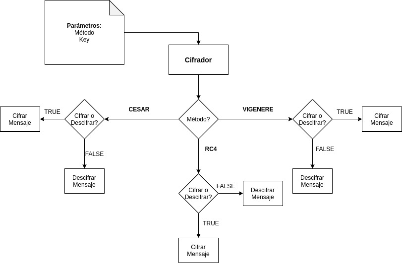
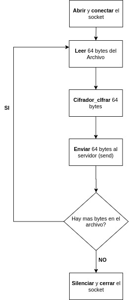
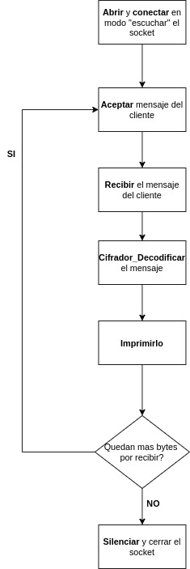

# TP1 - Crypto-Sockets
## Taller de Programación I - 2c 2020

| Nombre y Apellido | Padrón | 
| ----------- | ----------- |
| Daniela Genaro | 103440 |

Link al repositorio: https://github.com/danielagenaro98/tp1

En el presente trabajo se implementaron tres programas de encriptación, cesar, vigenere y rc4, además se implementaron dos programas los cuales actuarán como cliente o servidor, enviando y recibiendo mensajes respectivamente.
El cliente le envía los mensajes cifrados con algunos de los métodos de encriptación al servidor el cual recibe estos mensajes los descifra y los muestra.

A continuación se explicaran los rasgos generales de diseño del trabajo realizado.

# Diseño:

El trabajo consistió en realizar un módulo mediante el cual se puedan acceder a los distintos cifrados ya sea de parte del cliente o del servidor para que estos puedan mandar los mensajes cifrados o al recibirlos descifrarlos.

 

Módulo Cifrador e interacción con cifradores

 

El cliente y el servidor en cambio, fueron pensados cómo dos módulos separados los cuales interactúan entre sí mediante envío de mensajes siendo independiente la implementación de cada uno.

 

Cliente

 

 

Servidor

 

Los diagramas mostrados no representan detalles internos de implementación, solo muestran el flujo de cada módulo realizado en el trabajo.

# Problemas surgidos durante la realización del trabajo:

En el transcurso de la implementación del trabajo fueron surgiendo dudas, incógnitas y problemas a ir resolviendo, los mas relevantes fueron:

## Lógica de Vigenere:

Este cifrado resultó ser uno de los más difíciles (a criterio propio) de implementar dado que, la implementación de una clave la cual resultase "infinita" no se podía lograr sin almacenar un puntero a la última posición visitada en el último recibo de un mensaje partido.
Inicialmente se inició utilizando una función la cual reestructuraba la clave dada de forma tal que quede del mismo largo del mensaje obtenido, pero esto traía problemas dado que al obtener un mensaje "partido" en varias iteraciones no se conservaba la relación establecida con la clave inicialmente.
Esto finalmente se soluciono eliminando esta función de extensión o recorte de la clave a lo largo del mensaje y se implementó el algoritmo de forma que solo utilice la clave obtenida inicialmente y que además conserve una referencia a la posición en donde se detuvo en la clave, en la última iteración.

## Sockets:

La implementación de un TDA Socket fue de las incógnitas más importantes y difíciles de resolver solo por el hecho de nunca haber utilizado esta dinámica Cliente - Servidor. 

Para poder abordar esto se estructuró la implementación en etapas:

1) Implementar el cliente, haciendo que envie únicamente un mensaje, utilizando netcat como servidor.
2) Con el cliente funcionando para el envío de un mensaje, se probó el envío de varios mensajes en un loop.
3) Con el cliente enviando más de un mensaje, se implementó la lectura de un archivo por entrada estándar y el envío del mismo al servidor.
4) Cuando la lectura y envío de mensajes funcionaron se agregó la codificación del mensaje y posterior envío al servidor.
5) Cuando el cliente ya enviaba los mensajes cifrados al servidor (el cual continuó siendo netcat hasta ahora), se comenzó a implementar el servidor para que reciba un mensaje. En este caso se utilizó netcat como Cliente para comprobar el correcto funcionamiento del servidor que se estaba implementando.
6) Al obtener un servidor el cual recibe un mensaje, se procedió a implementar el recibo de varios mensajes recibidos por entrada estándar.
7) Una vez que el recibo de varios mensajes funcionó con normalidad se procedió a enviar mensajes del Cliente implementado previamente y recibirlos con el Servidor también implementado. En este caso solo se mostraba el mensaje encriptado por salida estándar.
8) Al lograr mostrar los mensajes encriptados por salida estándar, se procedió a agregar en el Servidor el descifrado de los mismos.
9) Finalmente se obtuvo un Cliente - Servidor funcionando mediante el cual se puede enviar mensajes cifrados y se reciben correctamente para descifrarlos y mostrarlos por salida estándar.
